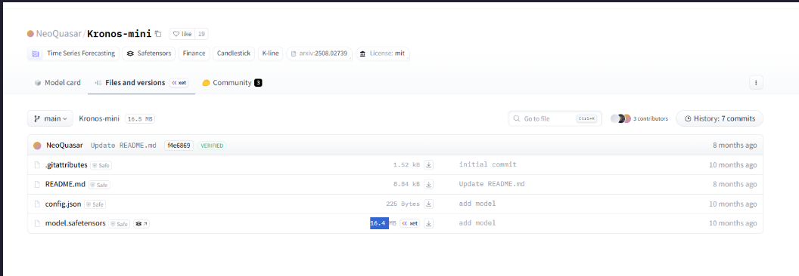

# Kronos-Mini 与 Kronos-Tokenizer-2k 区别说明

## 主要区别

| 对比项 | Kronos-Tokenizer-2k | Kronos-mini |
|--------|---------------------|-------------|
| **类型** | Tokenizer（分词器） | 模型（Model） |
| **大小** | 16.9 MB | 16.5 MB |
| **用途** | 将时间序列数据编码为模型输入 | 执行预测推理的神经网络模型 |
| **文件组成** | `model.safetensors` (15.8 MB) + `config.json` + `README.md` | `model.safetensors` (16.4 MB) + `config.json` + `README.md` |
| **功能** | 数据预处理：将K线数据转为token | 模型推理：根据token预测未来价格 |

<!-- 请在此处插入截图1：Kronos-Tokenizer-2k 的 Hugging Face 页面 -->
**图1：Kronos-Tokenizer-2k 截图**

---

<!-- 请在此处插入截图2：Kronos-mini 的 Hugging Face 页面 -->
**图2：Kronos-mini 截图**

---

## 简单理解

```
输入数据 → [Kronos-Tokenizer-2k] → tokens → [Kronos-mini] → 预测结果
         (编码)                    (推理)
```

- **Kronos-Tokenizer-2k** 是"翻译官"：把股票K线数据转换成模型能理解的数字序列
- **Kronos-mini** 是"预测大脑"：根据转换后的数据进行学习和预测

## 配置关系

在 `backend/config.py` 中需要同时配置两者：

```python
"kronos-mini": {
    "name": "Kronos-mini",
    # "model_id": "NeoQuasar/Kronos-mini",  # 注释掉或保留
    # "tokenizer_id": "NeoQuasar/Kronos-Tokenizer-2k",
    "local_model_path": "D:/models/kronos-mini",
    "local_tokenizer_path": "D:/models/Kronos-Tokenizer-2k",
    "context_length": 2048,
    "params": "4.1M",
    "description": "轻量级模型，适合快速预测，CPU 推理首选",
},
```

> **注意**：`context_length: 2048` 中的 **2k** 就是指这个 tokenizer 支持的最大序列长度（2048 = 2k）。
>
> **为什么选择 Kronos-mini？**
> - 参数更少：4.1M vs 24.7M（kronos-small）vs 102.3M（kronos-base）
> - 推理更快：CPU 推理约 5-15 秒
> - 上下文更长：2048 vs 512
> - 适合：个人用户、轻量级应用、CPU 部署

## 下载链接

| 组件 | 下载链接 | 大小 |
|------|----------|------|
| Kronos-mini | https://huggingface.co/NeoQuasar/Kronos-mini | 16.5 MB |
| Kronos-Tokenizer-2k | https://huggingface.co/NeoQuasar/Kronos-Tokenizer-2k | 15.9 MB |
